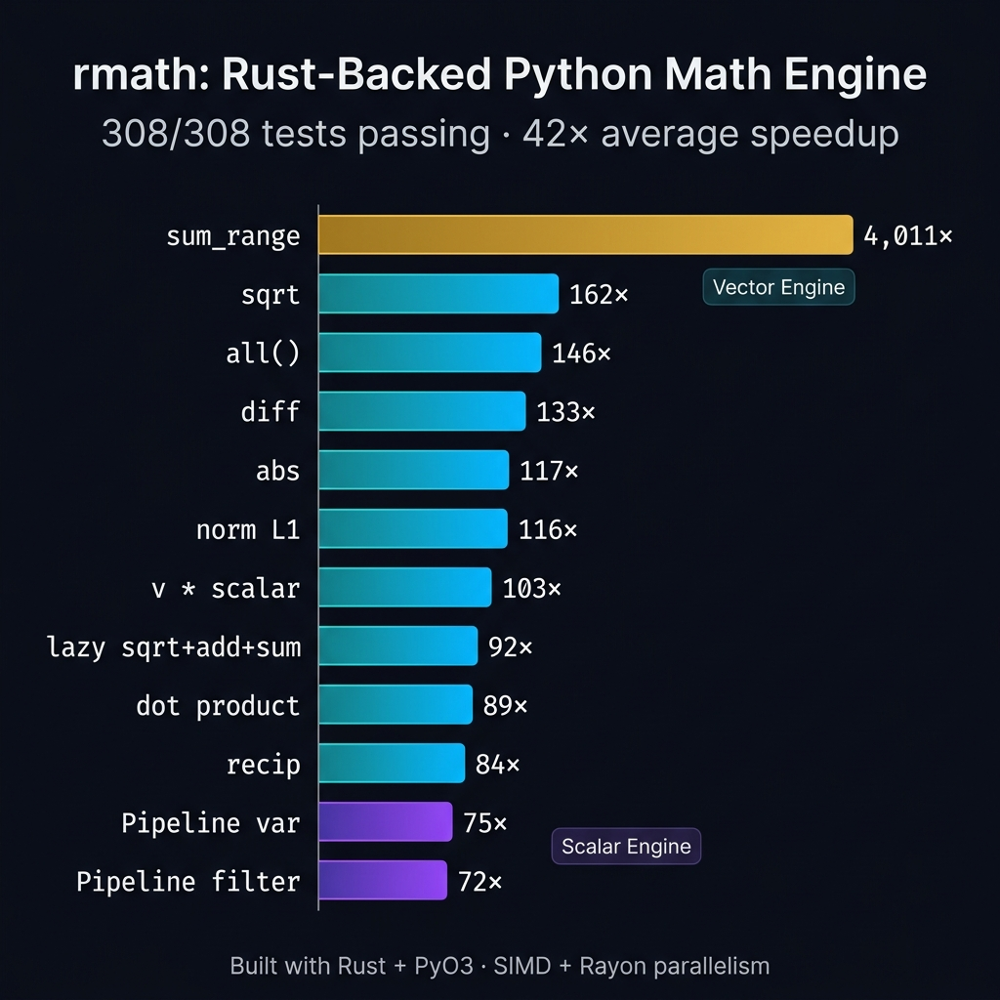

# LinkedIn Post Preview

## Chart Image



---

## Recommended Post (Option B — Story)

**"Why is your Rust code slower than Python?"**

That was the first benchmark result I saw when I started building rmath.

My Scalar type: 480ns per addition.
Python's float: 65ns.

I was 7× slower. In a "fast" language.

The problem wasn't Rust. It was the **boundary**.

Every time Python calls Rust, there's a ~200ns tax:
→ Extract the Python object
→ Type-check it
→ Cross the FFI bridge
→ Do the actual math (1ns)
→ Wrap the result
→ Cross back

For a single number, that tax is everything.

So I changed the question.

Instead of "how do I make one operation fast?"
I asked "how do I make one *million* operations fast?"

The answer: **never leave Rust.**

```
One FFI crossing, 100K elements:
  sqrt    → 162× faster
  dot     →  89× faster  
  std_dev →  71× faster
  
LazyPipeline (zero intermediate allocations):
  .sqrt().add(1).sum() → 92× faster
```

308 tests. 0 failures. 42× average speedup.

The lesson isn't about Rust vs Python.
It's about **where you draw the boundary.**

\#Rust #Python #Performance #Engineering #PyO3 #SystemsProgramming #OpenSource

---

> [!TIP]
> **Posting checklist:**
> 1. Upload the chart image above with the post
> 2. Drop your GitHub link in the **first comment**, not the post body
> 3. Post Tuesday–Thursday, 8–10 AM your timezone
> 4. Tag #PyO3 in the post for community reach
